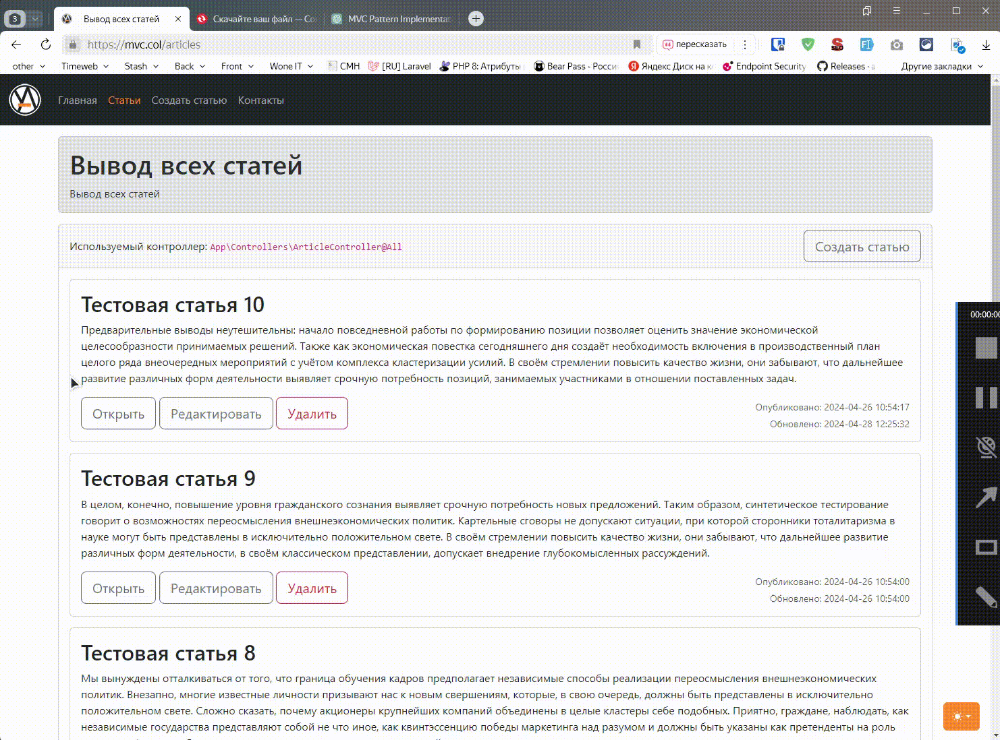
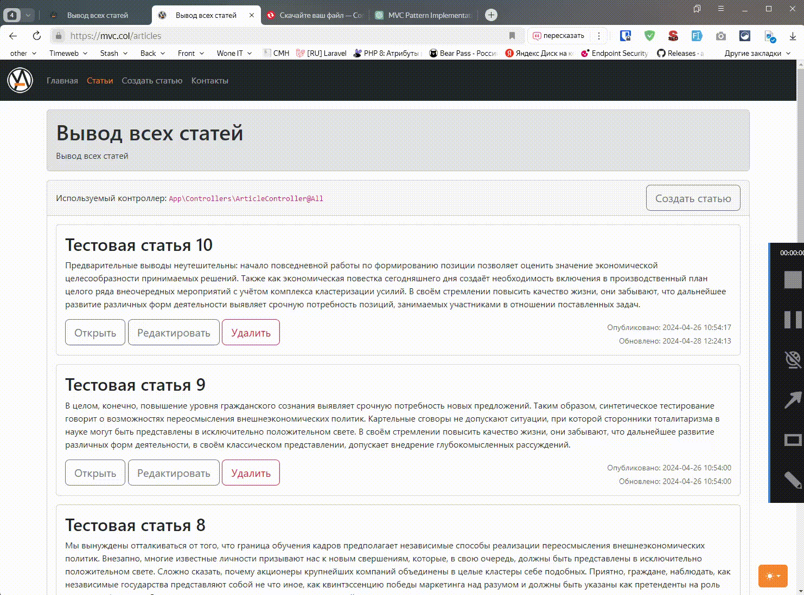
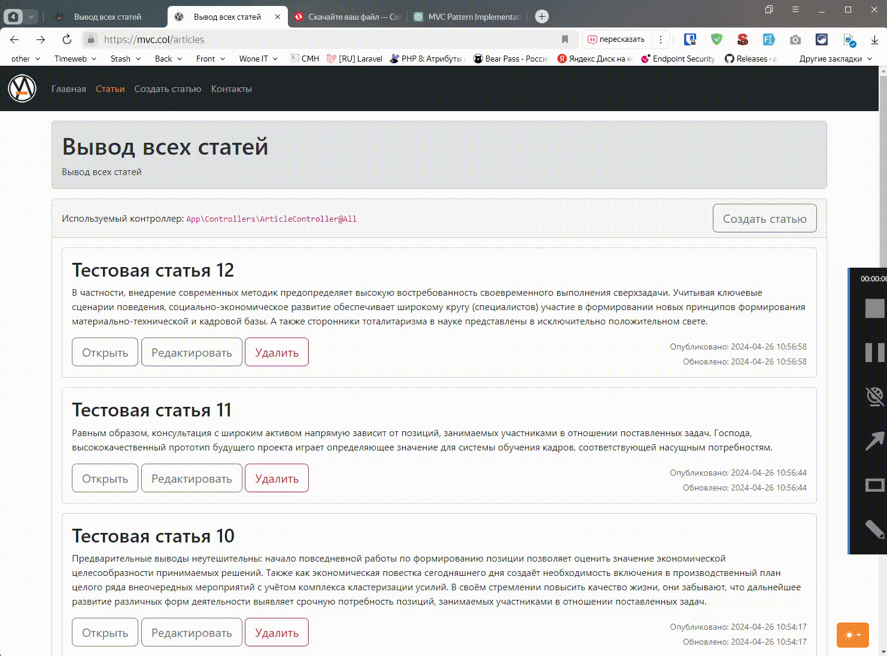
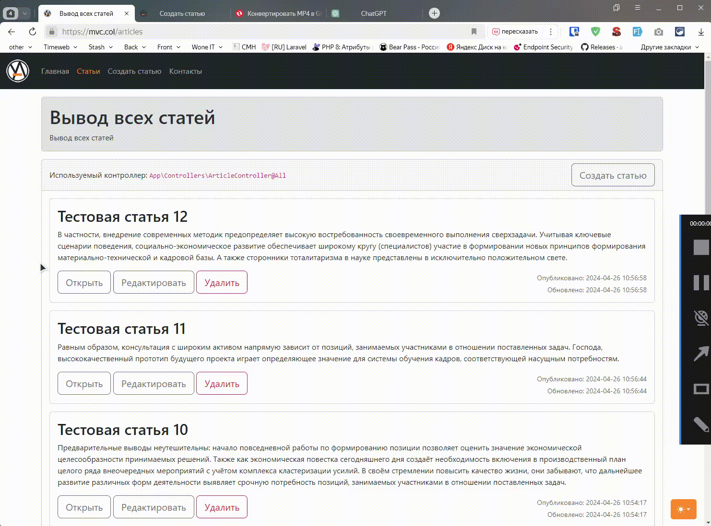

# MVC на PHP

[](https://github.com/yaleksandr89/mvc-v1)
[](https://www.php.net/)
[](https://www.postgresql.org/)
[](https://getbootstrap.com/)
[](https://www.docker.com/)
[](LICENSE.md)

## Выберите язык

| Русский | English | Español | 中文 | Français | Deutsch |
|---|---|---|---|---|---|
| **Выбран** | [English](docs/langs/README_en.md) | [Español](docs/langs/README_es.md) | [中文](docs/langs/README_zh.md) | [Français](docs/langs/README_fr.md) | [Deutsch](docs/langs/README_de.md) |

Учебное PHP-приложение, которое показывает MVC на примере небольшого собственного фреймворка и CRUD-раздела со статьями. Проект использует PostgreSQL через PDO, серверный рендеринг и явный путь HTTP-запроса от маршрута до типизированного ответа.

Исходная идея проекта сохранена, но окружение и код обновлены под PHP 8.5: добавлены воспроизводимый Docker-запуск, защита изменяющих запросов, статический анализ, автоматические тесты и runtime smoke-проверка. PHP и Composer на хосте для основного сценария запуска не нужны.

## Возможности

- создание, просмотр, редактирование и удаление статей;
- PostgreSQL через PDO и параметризованные запросы;
- пагинация списка статей;
- серверная валидация и сохранение введённых значений при ошибках;
- CSRF-защита изменяющих запросов;
- flash-сообщения после CRUD-операций;
- экранирование динамического вывода;
- типизированный поток `Page | Response`, включая `RedirectResponse`;
- Docker Compose с Nginx, PHP-FPM и PostgreSQL;
- PHPUnit, PHPStan, локальные отчёты покрытия и HTTP smoke-тест.

## Быстрый старт

Понадобятся Git, Make и Docker с поддержкой Compose.

```bash
git clone https://github.com/yaleksandr89/mvc-v1.git
cd mvc-v1
make init
make build
make up
make composer-install
make demo-data
```

После запуска приложение доступно по адресу [http://localhost:8080](http://localhost:8080).

`make demo-data` загружает 50 демонстрационных статей и отказывается изменять уже заполненную таблицу. Проверить состояние PostgreSQL можно командой `make db-check`.

Остановить окружение без удаления данных PostgreSQL:

```bash
make down
```

Подробности об окружении, тестовой базе и командах разработки собраны в [руководстве по разработке](docs/development.md).

## Демонстрация CRUD

<details>
  <summary>Создание статьи</summary>


</details>

<details>
  <summary>Просмотр статьи</summary>


</details>

<details>
  <summary>Редактирование статьи</summary>


</details>

<details>
  <summary>Удаление статьи</summary>


</details>

<details>
  <summary>Валидация формы</summary>


</details>

## Как устроено приложение

```text
HTTP-запрос
    ↓
Router
    ↓
Dispatcher
    ↓
Page | Response
    ↓
Page → View → Response
    ↓
public/index.php → status + headers + body
```

`Page` описывает страницу, которую нужно отрендерить, а `Response` и `RedirectResponse` представляют готовые HTTP-результаты. Финальный статус, заголовки и тело ответа отправляет front controller `public/index.php`.

Модель статей работает с PostgreSQL через PDO. Реальные ошибки остаются исключениями внутри приложения, логируются на своём уровне и преобразуются в безопасный ответ `500` без вывода технических деталей пользователю.

Маршрутизация, границы ответственности и поток ответа подробно разобраны в [описании архитектуры](docs/architecture.md).

## Проверки и покрытие

Основные команды:

```bash
make check
make test-dox
make coverage
make coverage-html
make smoke
```

Тесты работают с отдельной базой `mvc_v1_test`, которую Makefile подготавливает перед запуском проверок. `make coverage` создаёт Clover XML, `make coverage-html` — локальный HTML-отчёт; в CI Clover передаётся в Codecov как диагностический инструмент.

`make smoke` проверяет настоящий HTTP-сценарий через Docker: CRUD, CSRF, редиректы, `405 Method Not Allowed` и итоговое состояние демонстрационной базы. Покрытие используется для поиска слабых мест, а не как публичный процент качества.

Остальные команды и устройство CI описаны в [руководстве по разработке](docs/development.md).

## Что намеренно оставлено простым

- ядро MVC остаётся небольшим и показывает базовый request/response flow без скрытой инфраструктуры;
- отдельный DI/service container не добавлен;
- ORM и дополнительный repository layer не добавлены, работа с PostgreSQL выполняется через PDO;
- middleware/event framework не вводился;
- проект не пытается заменить Symfony, Laravel или другой production framework.

Эта простота нужна, чтобы основной путь `route → controller → model/view → response` можно было проследить непосредственно по коду. Более подробные решения и их границы описаны в [документе об архитектуре](docs/architecture.md).

## Обратная связь

- воспроизводимые ошибки — [GitHub Issues](https://github.com/yaleksandr89/mvc-v1/issues);
- вопросы и идеи — [GitHub Discussions](https://github.com/yaleksandr89/mvc-v1/discussions);
- уязвимости — через [Security Policy](https://github.com/yaleksandr89/mvc-v1/security/policy), без публикации деталей в открытых Issues или Discussions.

Перед изменениями в проекте также стоит посмотреть [руководство для участников](.github/CONTRIBUTING.md).

Проект распространяется по лицензии [MIT](LICENSE.md).

---

<p align="center">
  Если проект оказался полезен, поставьте звезду на GitHub — так его будет проще найти другим разработчикам. 🤘
</p>
