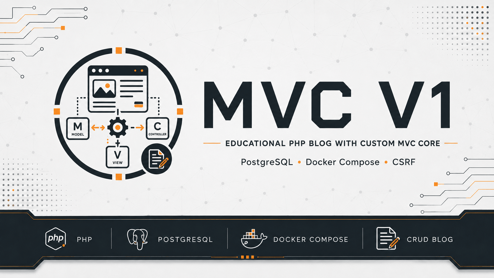

# MVC in PHP

[](https://github.com/yaleksandr89/mvc-v1)
[](https://github.com/yaleksandr89/mvc-v1/actions/workflows/ci.yml)
[](https://www.php.net/)
[](https://www.postgresql.org/)
[](https://www.docker.com/)
[](../../LICENSE.md)

<p align="center">
  
</p>

## Choose a language

| Русский | English | Español | 中文 | Français | Deutsch |
|---|---|---|---|---|---|
| [Русский](../../README.md) | **Selected** | [Español](./README_es.md) | [中文](./README_zh.md) | [Français](./README_fr.md) | [Deutsch](./README_de.md) |

This is one of my first projects with an MVC implementation written from scratch instead of relying on a ready-made framework. The example is a simple article blog: routing, controllers, models, views, and CRUD are arranged so the entire request path can be followed through the project's own code.

The project deliberately avoids becoming a collection of ready-made libraries. PostgreSQL is accessed directly through PDO, without an ORM. There are no third-party PHP libraries in the production code: the custom MVC core is connected as the local Composer package `yaa/mvc-framework`, while the application relies on PHP and the required `mbstring`, `PDO`, and `pdo_pgsql` extensions.

> [!NOTE]
> **UPD 2026.** The original idea has not changed: this is still the same small MVC project, now brought up to date for PHP 8.5, current PostgreSQL and Bootstrap versions, and safer handling of state-changing requests. Docker Compose provides a reproducible local setup without requiring PHP or Composer on the host, while manual setup without Docker remains fully supported.

## Features

- create, view, edit, and delete articles;
- PostgreSQL through PDO and parameterized queries;
- article list pagination;
- server-side validation that preserves entered values after errors;
- CSRF protection for state-changing requests;
- messages after CRUD operations;
- escaping of dynamic output;
- typed `Page`, `Response`, and `RedirectResponse`;
- Docker Compose with Nginx, PHP-FPM, and PostgreSQL.

## Quick start

You need Git, Make, and Docker with Compose support.

| Command | What it does | Note |
|---|---|---|
| `git clone https://github.com/yaleksandr89/mvc-v1.git` | Clones the repository | |
| `cd mvc-v1` | Enters the project directory | |
| `make init` | Creates `.env.docker` and working directories | Usually run once after cloning |
| `make build` | Builds the PHP Docker image | |
| `make up` | Starts Nginx, PHP-FPM, and PostgreSQL | |
| `make composer-install` | Installs dependencies from `composer.lock` | PHP and Composer are not required on the host |
| `make demo-data` | Loads 50 demo articles | Only into an empty `blog_posts` table |
| `make down` | Stops the environment | PostgreSQL data is preserved |

After startup, the application is available at [http://localhost:8080](http://localhost:8080).

> [!IMPORTANT]
> `make demo-data` works only with an empty `blog_posts` table. If the table already contains data, the command stops without overwriting anything. To recreate the local PostgreSQL storage completely and immediately load demo data, use `make postgres-reinit CONFIRM=postgres18 WITH_DEMO_DATA=1`; this command removes the local PostgreSQL volume.

Environment details, the isolated test database, the remaining commands, and manual setup without Docker are documented in the [development guide](../development.md).

## How the application works

```text
HTTP request
    ↓
Router
    ↓
Dispatcher
    ↓
Page | Response
    ↓
Page → View → Response
    ↓
public/index.php → status code + headers + body
```

`Page` describes a page that still needs to be rendered, while `Response` and `RedirectResponse` represent complete HTTP responses. The status code, headers, and body are sent only by the `public/index.php` entry point.

The article model works with PostgreSQL directly through PDO. Real failures remain exceptions inside the application, are logged at the appropriate layer, and are converted into a safe `500` response without exposing technical details to the user.

Routing, responsibility boundaries, and the complete request path are explained in the [architecture guide](../architecture.md).

## Checks and coverage

| Command | What it does | Note |
|---|---|---|
| `make test` | Runs PHPUnit | Resets the isolated test database first |
| `make test-dox` | Runs PHPUnit with readable scenario names | |
| `make check` | Checks Composer, dependencies, PHPStan, and PHPUnit | Main combined quality check |
| `make coverage` | Prints coverage and creates Clover XML | Output: `runtime/coverage.xml` |
| `make coverage-html` | Creates an HTML coverage report | Output: `runtime/coverage/index.html` |
| `make smoke` | Checks the application through real HTTP requests | Requires 50 demo articles |

Tests use the separate `mvc_v1_test` database, so the main development database is not touched when they run.

The full list of Make commands and the CI setup are documented in the [development guide](../development.md).

## What is intentionally kept simple

- the MVC core remains small so the main request path can be followed directly through the code;
- no separate dependency injection container was added;
- no ORM or additional repository layer was added; PostgreSQL access goes through PDO;
- no middleware pipeline or event system was introduced.

These decisions and responsibility boundaries are described in more detail in the [architecture guide](../architecture.md).

## Feedback

- reproducible bugs → [GitHub Issues](https://github.com/yaleksandr89/mvc-v1/issues);
- questions and ideas → [GitHub Discussions](https://github.com/yaleksandr89/mvc-v1/discussions).

---

<p align="center">
  If the project was useful, give it a star on GitHub — it helps other developers find it. 🤘
</p>
