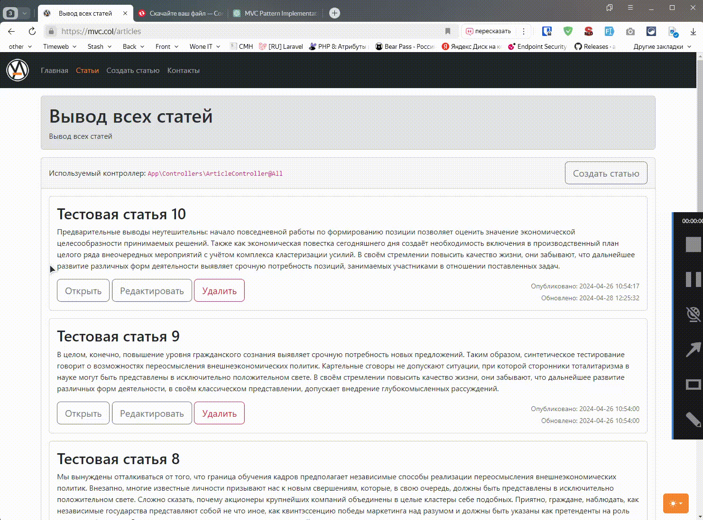
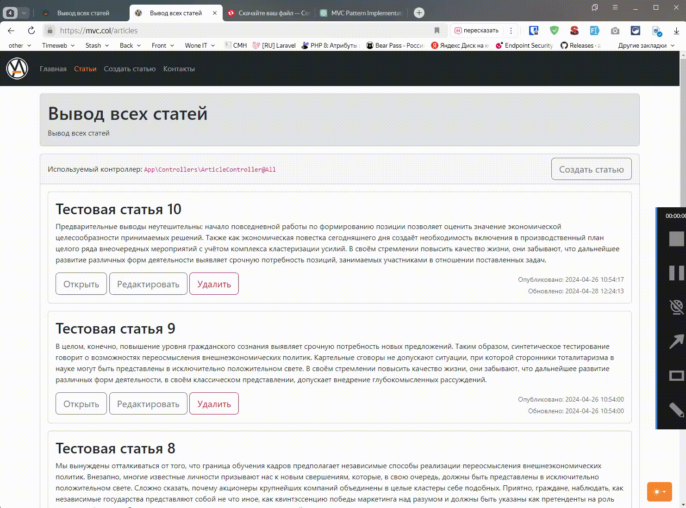
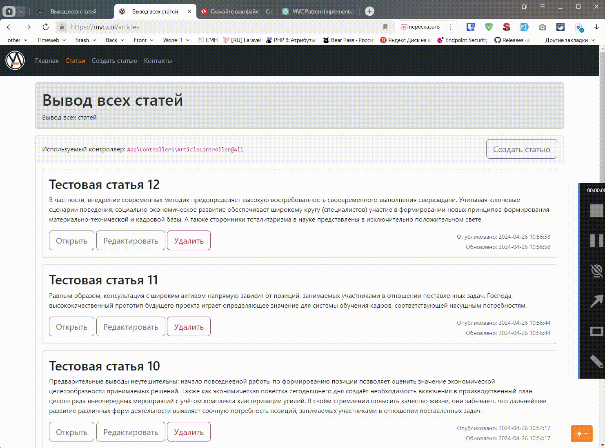
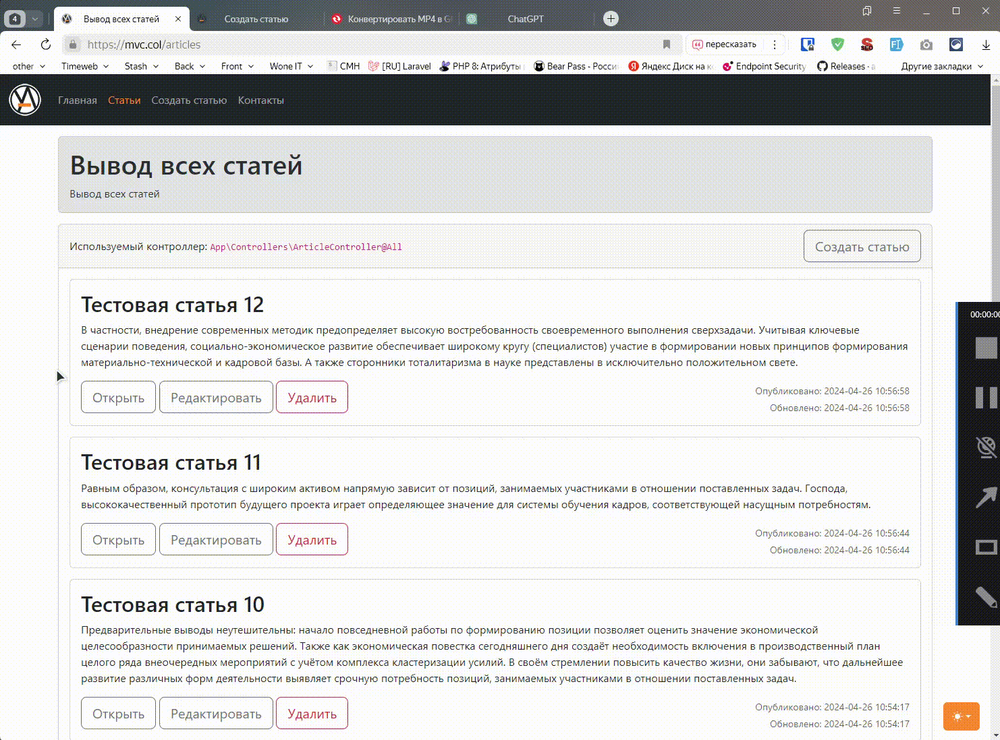

# Proyecto: Implementación del patrón arquitectónico MVC utilizando un ejemplo básico de framework

## Elija Idioma:

| Русский                                                     | English                   | Español                              | 中文                              | Français                              | Deutsch                              |
|-------------------------------------------------------------|---------------------------|--------------------------------------|---------------------------------|---------------------------------------|--------------------------------------|
| [Русский](../../README.md) | [English](./README_en.md) | **Seleccionado** | [中文](./README_zh.md) | [Français](./README_fr.md) | [Deutsch](./README_de.md) |

## Stack Utilizado:

- PHP 8
- Postgresql (PDO)
- Bootstrap 5.3

## Descripción:

El proyecto implementa el patrón arquitectónico MVC utilizando un framework casero simple como ejemplo. Dentro del framework, se implementaron operaciones CRUD para la sección de "Artículos":

  
Creación

  
Visualización

  
Actualización

  
Eliminación

La validación se implementa durante la creación y actualización del artículo:

  
Proceso de Validación

En el directorio `docs/conf/` se encuentra: `nginx-configuration.conf` - un archivo de configuración de ejemplo para `nginx`.

## Ejecución del Proyecto:

1. Agregue la configuración a su servidor. Puede utilizar el archivo de `docs/conf/` como base.
2. Ejecute `composer i`
3. Cambie el nombre de `.env.example` a `.env` y complete la sección `# DB info`
4. Cree una base de datos e importe el contenido del archivo `db_dump.sql` (comando de ejemplo para importar: `sudo -iu postgres psql -U postgres mvc_v1 < /www/mvc-v1.col/docs/db_dump.sql`), que se encuentra en la carpeta `docs/`.

> Los cambios realizados en 2024 son mínimos. Mantuve intencionalmente la estructura principal del original, no agregué funcionalidad de contenedor, DI, etc. Dado que este es uno de mis primeros trabajos, decidí mantenerlo casi en su forma original 😇
